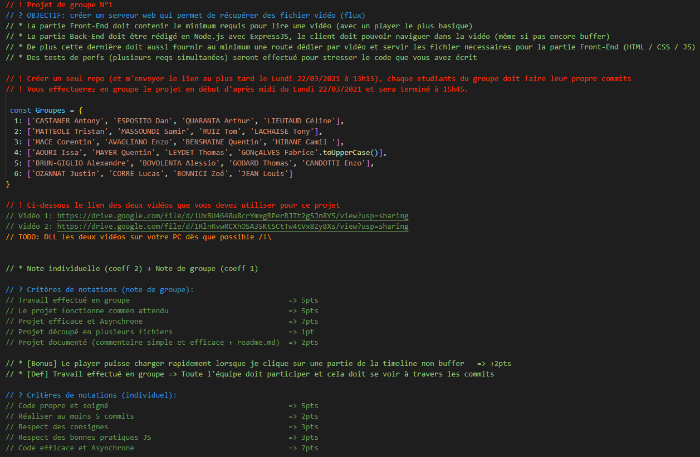

# nodeStreaming
> Projet scolaire de groupe sur Node.js pour *Ynov Campus Aix-en-Provence*

## Sujet :

## Composition du groupe :

|Membre                         |Travail                      |
|-------------------------------|-----------------------------|
|`LACHAISE Tony`            |- Initialisation Express, liasion Back-Front|
|`MASSOUNDI Samir`            |- Mise en place du git, structure du site,             |
|`MATTEOLI Tristan`|- Travail organisationnel, edition du README.md, mise en place des routes|
|`RUIZ Tom`|- Création du controller principal|

## Procédure d'installation :

 >- Cloner le repository git du projet complet depuis la branche master.
 >- Télécharger les 2 vidéos (liens plus bas) et les mettre dans le dossier assets.
 >- Nous utilisons `express` afin de lancer l'application. Pour l'installer -> `npm install express`.
 >- Pour lancer l'application utilisez la commande -> `node ./server.js` (permet de le faire tourner en local. Nous utiliserons un serveur lors de la mise en production).
 >- Pour se connecter à l'application, aller sur l'url du `localhost` décrit après avoir lancé la commande `node ./server.js`

## Etapes de créations du projet :
 > - Mise en place du git
 > - Mise en place de la structure du html
 > - Mise en place des scripts (express, boostrap ...)
 > - Mise en place des routes 
 > - Ajout des players sur les routes 
 > - Implémentation des vidéos dans les players
 > - Tests de performances (plusieurs requetes simultanées)
 

## Liens des vidéos :

> https://drive.google.com/file/d/1UxRU4648u8crYmxgRPerRJTt2gSJn8Y5/view?usp=sharing  
> https://drive.google.com/file/d/1RlnRvwRCXhOSA35KtSCtTw4tVx8Zy8Xs/view?usp=sharing
